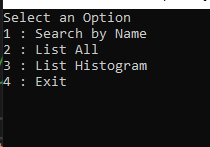
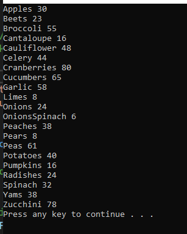
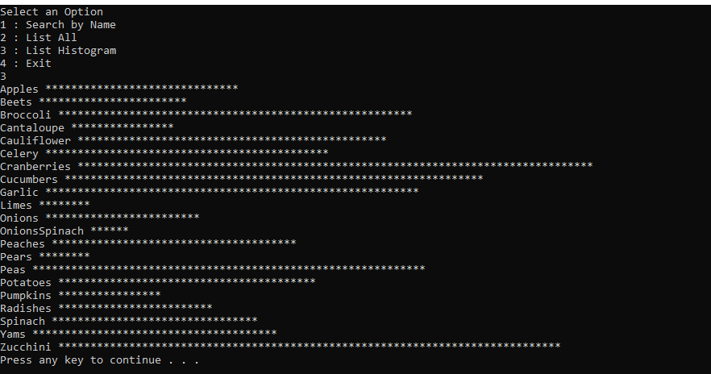

# Corner Grocer

Corner Grocer is a C++ application developed to help grocery store owners track the frequency of items sold. The program processes a file containing records of items sold and provides functionalities such as listing all items sold, generating a histogram of sales, and more.

---

## Features

- **List All Items:** Displays all items sold along with their respective counts.
- **Histogram Generation:** Visualizes item frequencies in a histogram format.
- **User-Friendly Menu:** Interactive menu for navigating through functionalities.

---

## Example Screenshots

### Main Menu


### List All Items


### Histogram


---

## Installation

### Prerequisites

- **C++ Compiler:** Ensure you have a modern C++ compiler installed (e.g., `g++`, `clang`).
- **Build Tools:** Tools like `make` or an IDE such as Visual Studio.
- **Operating System:** Compatible with Windows, macOS, or Linux.

### Steps

1. **Clone the Repository**
   ```bash
   git clone https://github.com/nothingmakes-sense/CornerGrocer.git
   cd CornerGrocer
   ```

2. **Compile the Program**
   - Using `g++`:
     ```bash
     g++ -o CornerGrocer main.cpp
     ```
   - Using Visual Studio:
     - Open the project in Visual Studio.
     - Build the solution.

3. **Run the Program**
   ```bash
   ./CornerGrocer
   ```

4. **Input File**
   - Ensure the input file (e.g., `sales_data.txt`) is in the same directory as the compiled binary.

---

## Usage

- Follow the on-screen menu to select functionalities.
- Input the file containing sales data when prompted.

---

## Contributing

Contributions are welcome! Feel free to fork the repository and submit a pull request.

---
## QA

*Summarize the project and what problem it was solving.*

> The project is an application for the supposed client Corner Grocer. The application receives a file that has the items sold in chronological and Corner Grocer wants to see how many of the items it sold for remodeling purposes.

*What did you do particularly well?*

> I'm not sure if there is anything done well but I'd like to think that the organization and execution are well done.

*Where could you enhance your code? How would these improvements make your code more efficient, secure, and so on?*

> I see plenty of room for enhancements and improvements. One such example is how the program does not keep track of when the items were purchased chronologically, it only keeps track of the first time a type of item was purchased. It wouldn't help through efficiency but would with delivery. The application is generally secure. It follows general secure coding practices such as ACID (atomicity, consistency, isolation, durability).

*Which pieces of the code did you find most challenging to write, and how did you overcome this? what tools or resources are you adding to your support network?*

> The most difficult part of the code to write was getting all of the menu functions inside of resource files and using them as intended. Specifically, there was an exception it would throw for one of the menu functions accessing a non-member item. To overcome this, I retyped the code with a few different methods and one didn't have issues.
  
*What skills from this project will be particularly transferable to other projects or coursework?*

> I've greatly benefited in how I understand pointers, how they work, and how to use them throughout the course. I have also improved at using Visual Studio, though I would like to get into NeoVim.

*How did you make this program maintainable, readable, and adaptable?*

> To make the program maintainable, readable, and adaptable I documented all of the functions with specific comments. I also got set on making the main program file as minimal as possible. To do this I set all functions in resource files specific to uses. This allows any developer to understand, modify, and expand the code in an easy and replicable manner.

> Example Images of the working application.


